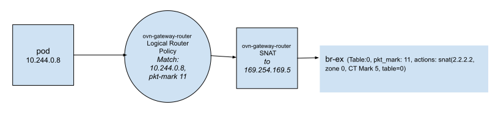
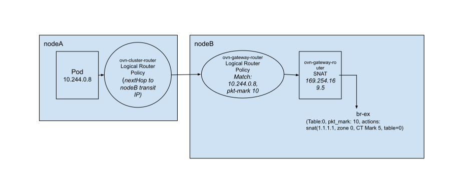
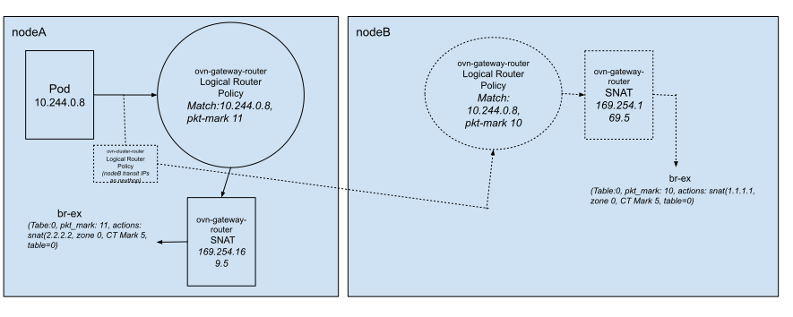
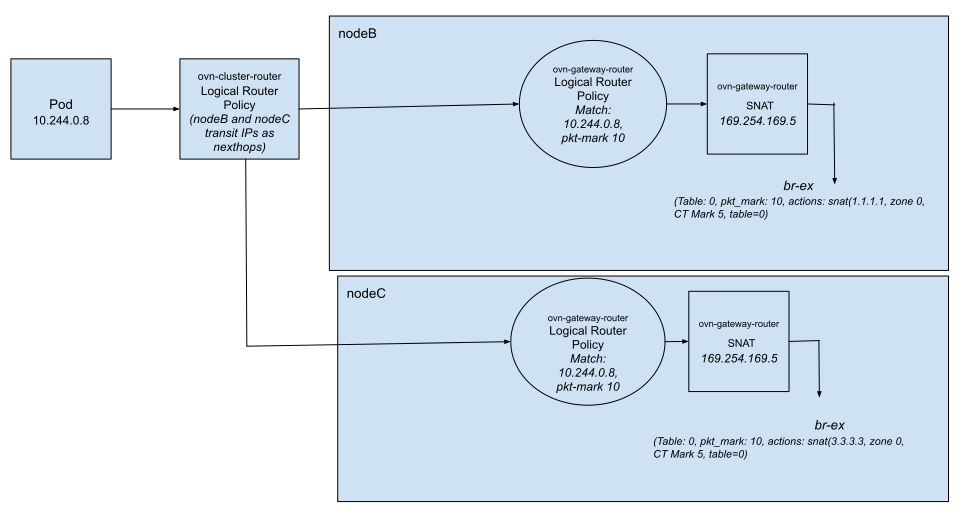
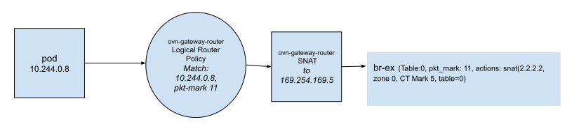
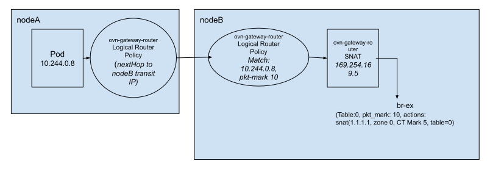
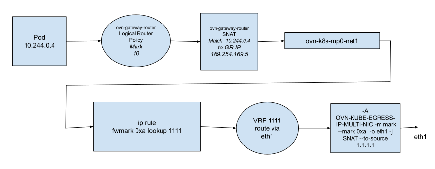
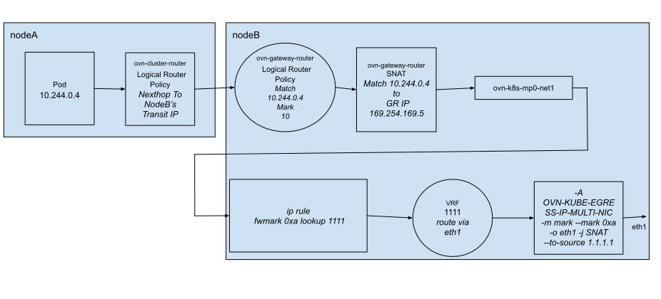

# OKEP-4456: EgressIP support on user defined networks

* Issue: [#4456](https://github.com/ovn-org/ovn-kubernetes/issues/4456)

## Problem Statement

OVN-Kubernetes today allows multiple different types of networks per secondary network: layer 2, layer 3, or localnet. Pods can be connected to different networks without discretion. For the primary network, OVN-Kubernetes only supports all pods connecting to the same layer 3 virtual topology. There is separate effort is to bring the same flexibility of the secondary network to the primary network. Therefore, pods are able to connect to different types of networks as their primary network.

Additionally, multiple and different instances of primary networks may co-exist for different users, and they will provide native network isolation.

Once this flexibility is provided on the pod's primary network, then there should be an ability for EgressIP to support egress traffic on these user defined networks.

## Goals

- Provide a mechanism to configure EgressIP for a pod which is served by a user defined primary network. Since the cluster default network will also be attached and will only be used for kAPI & DNS access, therefore we will not configure the cluster default network for EgressIP.
- Ensure existing EgressIP functionality works when the cluster default network is the primary network.
- EgressIP support for both L2 and L3 primary user defined networks.
- EgressIP support for primary user defined networks in both shared and local gateway modes.
- Ensure EgressIP assigned to a host secondary network is available for primary user defined networks.

## Non-Goals

- Support EgressIP on non-primary user defined networks.

## Introduction

For more information about supporting user defined networks in OVN-Kubernetes, refer to this [link](https://github.com/trozet/enhancements/blob/multiple_networks/enhancements/network/user-defined-network-segmentation.md).

Today, we can get a deterministic pod source IP when traffic egresses a Kubernetes Node using the EgressIP feature.
OVN logical router policies are created within OVN Logical Router (LR) `ovn_cluster_router` which steer traffic towards the interface we wish to egress. There are two different routing policies on egress nodes depending on which interface we wish to egress:
- When an EgressIP IP is assigned to the nodes host primary interface, a pods packet is sent towards the chosen egress nodes OVN Gateway Router (GR) and then the packets are SNAT’d by that GR to the egress IP, and sent to br-ex.
- When an EgressIP IP is assigned to a host secondary interface, a pods packet is sent to the nodes management port and from there it is routed towards the assigned interface and SNAT'd by the kernel networking stack.

The primary user defined networks serving namespaces can have overlapping IP subnets (but not with the cluster default IP subnet), also in case of L2 user defined networks, there is no OVN LR `ovn_cluster_router` and join switch to connect pod logical network with a nodes GR. So EgressIP used today for the cluster default primary network will need changes so that it can also work with primary user defined networks.

## User-Stories/Use-Cases
#### Story 1

As a user of OVN-Kubernetes, I should be able to utilize the EgressIP feature for primary user defined L2/L3 networks.

#### Story 2

As a user of OVN-Kubernetes, I should be able to utilise the EgressIP high availability feature for primary user defined L2/L3 networks.

#### Story 3

As a user of OVN-Kubernetes, I should be able to utilize the EgressIP feature for pods which only have connectivity to the cluster default network.

#### Story 4

As a user of OVN-Kubernetes, I should be able to continue EgressIP on pods where some set of pods have cluster default network as their primary network while other set of pods have user defined networks as their primary network.

#### Story 5

As a user of OVN-Kubernetes, I should be able to utilize the EgressIP feature to allow consistent source IP when egress-ing secondary host interfaces from pods which have connectivity to primary user defined networks..

## Proposed Solution

The EgressIP should work seamlessly irrespective of whether the pod is either managed by a primary cluster default network or primary user defined networks or overlapping subnets being used in user defined networks across namespaces, the same EgressIP is used to manage different user defined networks, etc. From a user perspective this should not have any impact on EgressIP at API level. At the same time this poses some challenges for EgressIP in the dataplane to send and receive pod egress traffic.

Consider the scenario, podA and podB assigned with same IP address 10.244.0.8, but assigned from different user defined networks (say from netA and netB),
both pods are served by same EgressIP 1.1.1.1, now two pods are trying to connect externally using the same source and destination port, when SNAT happens on OVN's Gateway Router (GR), both pod traffic would have same 5-tuple and collision happen at br-ex. To avoid this, SNAT must be moved from OVN gateway router into br-ex  with appropriate flow rules to avoid the collision.

When traffic from both EgressIP and Non-EgressIP pods arrive at br-ex with GR masquerade IP used as the source IP address, there should be a way to distinguish the packet belongs which pod so that SNAT for EgressIP can applied, otherwise it would be SNATed with node's IP address. The EgressIP pod is packet marked using OVN's Logical Router Policy (LRP) and flow rule in br-ex match on `pkt_mark` to apply SNAT.

There is a need for each EgressIP object mapped with a unique packet mark identifier so that it doesn't create conflict between two different EgressIP objects serving two different namespaces but managed by the same user defined network. Since the name of the EgressIP object is a unique value globally, This can be used to derive packet marker identifiers using go libraries like `hash/fnv`, The maximum allowed value for the identifier is 2^32-1.

### Handling of EgressIP in L3 default cluster network and user defined network

The existing default primary network implementation for EgressIP is changed with following. This applicable for both shared and local gateway modes.

* The existing EgressIP's ovn-cluster-router LRP entry would continue to be present.
The ovn-cluster-router is global in case of Non-IC deployment, so it must reroute pod traffic into EgressIP assigned node's GR IP address.
In case of IC deployment, when EgressIP resides on remote node, it must reroute the packet via node's transit IP address, when EgressIP resides locally to the pod, then LRP entry can be skipped.
* The EgressIP assigned node's must have ovn-gateway-router LRP entry to do `pkt_mark` for the matching pod IP address.
* The programming of ovn-gateway-router SNAT entry must be skipped.
* Create appropriate flow rules in `Table 0` matching on `pkt_mark` with actions `snat(<EIP>, zone 0, CT Mark 5, table=0)`. This would need flow entry per EgressIP object and not at per pod level. So this flow rule can just exist as long as EgressIP is assigned to the node.

The below tables represent how OVN and OVS entries are manipulated to handle EgressIP for L3 primary network scenarios.

```
+-------------------------------------------------------------------------------------------------------------------------------------------------+
|                                           primaryeip-cdn-l3-ic and primaryeip-udn-l3-ic                                                         |
+==================================+==============================+======================================================+========================+
| EgressIP and Pod's node is local | Egress node is local,        | Egress node is remote,                               | Egress node is remote, |
|                                  | Pod is remote                | Pod is local                                         | Pod is remote          |
+----------------------------------+------------------------------+------------------------------------------------------+------------------------+
| Ovn_cluster_router               | Ovn_cluster_router           | Ovn_cluster_router                                   | Do nothing             |
| - LRPs                           | - LRPs                       | - LRPs                                               |                        |
| Node GW router                   | Node GW router               |   - Reroute to remote node                           |                        |
| - LRPs                           | - LRPs                       | Node GW router                                       |                        |
|   - Pkt mark based on pod IP     |   - Pkt mark based on pod IP | - LRPs                                               |                        |
| br-ex                            | br-ex                        | br-ex                                                |                        |
| - SNAT based on mark             | - SNAT based on mark         |                                                      |                        |
+----------------------------------+------------------------------+------------------------------------------------------+------------------------+
* cdn - cluster default network
* udn - user defined network
* ic - ovn interconnect
* primaryeip - EgressIP is on node's primary interface.
```
```
+-------------------------------------------------------+
| primaryeip-cdn-l3-non-ic and primaryeip-udn-l3-non-ic |
+=======================================================+
| Ovn_cluster_router                                    |
| - LRPs                                                |
|   - Redirect to egress nodes GR IP address            |
| Egress Node(s) GW router                              |
| - LRPs                                                |
|   - Pkt mark based on pod IP                          |
| Egress node(s) Br-ex                                  |
| - SNAT based on mark                                  |
+-------------------------------------------------------+
````

The following diagrams provides how EgressIP flow is handled in L3 user defined network scenarios.

#### podA on nodeA and served by eip on nodeA



#### podA on nodeA served by eip on nodeB



#### podA on nodeA served by two EIPs from two different objects one on nodeA and other on nodeB
(note that One EIP is active and the other is in standby)



#### podA on nodeA served by twp EIPs from same object where one is nodeB and other is nodeC



### L2 user defined primary network

For layer 2, egress IP has never been supported before. With the IC design, there is no need to have an ovn_cluster_router and join switch separating the layer 2 switch network (transit switch) from the GR.

To handle this scenario, the corresponding LRP must be created in egress node's GR to do packet marking and SNAT must happen in br-ex as similar to L3 user defined networks. The GR must also handle redirects via GW LRPs when a node contains a pod thats selected by an EIP.

```
+-------------------------------------------------------------+
| primaryeip-udn-l2                                           |
+=============================================================+
| non-Egress Node GW router where pod selected by EIP resides |
| - LRPs                                                      |
|   - Reroute to egress GW router                             |
| non-Egress Node Br-ex where pod selected by EIP resides     |
| Egress Node GW router                                       |
|- LRPs                                                       |
|  - Pkt mark based on pod IP                                 |
| Egress Br-ex                                                |
| - SNAT based on pkt mark                                    |
+-------------------------------------------------------------+
```

The following diagrams provides how EgressIP flow is handled in L2 user defined network scenarios.

#### podA on nodeA and served by eip on nodA



#### podA on nodeA and served by eip on nodB



### EgressIP assigned to a secondary host interface

The packet marking is done on the EgressIP's ovn-cluster-router Logical Router Policy and the pod IP address is SNATed with Gateway Router IP address before it's sent onto kernel's mp0-net. The SNATing is needed here to avoid the collision that was discussed before.

The ip rule on the host which matches on packet marking, then makes the packet to get forwarded into a custom VRF table something like this.

```
5000:	fwmark 0xa lookup 1111
```

The existing ip rule to skip Non-Egress IP pod and host networked pod traffic to go over via VRF table is no longer needed because of packet marking now. This can be safely removed.

```
5999:	from all fwmark 0x3f0 lookup main
```

The MultiNIC feature for EgressIP uses a separate VRF device for every egress interface. The table ID for the VRF is derived like this `1000 + ifIndex`.
The EgressIP on user defined networks can continue to use the same VRF table for the routing.
The routing in the VRF table doesn’t need to introduce any new changes, it can just continue to have a default route and import existing routes for the interface from the default VRF table.

```
sh-5.2# ip route show table 1111
default dev eth1
```

The ip table entry in OVN-KUBE-EGRESS-IP-MULTI-NIC chain would be changed to match only on packet mark to do SNAT with EgressIP address.
This alleviates the need for ip table entry per pod.

```
-A OVN-KUBE-EGRESS-IP-MULTI-NIC -m mark --mark 0xa -o eth1 -j SNAT --to-source 1.1.1.1
```
```
+----------------------------------------------------------------------------------------------------------------------------------------------------+
|                                             secondaryeip-cdn-l3-ic and secondaryeip-udn-l3-ic                                                      |
+============================================+==================================================+===========================+========================+
| Egress node is local,                      | Egress node is local,                            | Egress node is remote,    | Egress node is remote, |
| pod is local                               | pod is remote                                    | pod is local              | pod is remote          |
+--------------------------------------------+--------------------------------------------------+---------------------------+------------------------+
| Ovn_cluster_router                         | Ovn_cluster_router                               | Ovn_cluster_router        | Do nothing             |
| - LRPs                                     | - LRPs                                           | - LRPs                    |                        |
| Gw router                                  | Node GW router                                   | Node GW router            |                        |
| - LRPs                                     | - LRPs                                           | - LRPs                    |                        |
|   - Redirect to its mgnt port and pkt mark |   - Redirect to its mgnt port and pkt mark       |   - Redirect to remote ts |                        |
| IP rules                                   | IP rules                                         | IP rules                  |                        |
| - Match on mark and redirect to vrf        | - Match on mark and redirect to vrf              | IPTables                  |                        |
| IPTables                                   | IPTables                                         |                           |                        |
| - SNAT back on pkt mark                    | - SNAT back on pkt mark                          |                           |                        |
| - Save mark for rpl                        | - Save mark for rpl                              |                           |                        |
+--------------------------------------------+--------------------------------------------------+---------------------------+------------------------+
```
```
+-----------------------------------------------------------+
| secondaryeip-cdn-l3-non-ic and secondaryeip-udn-l3-non-ic |
+===========================================================+
| Ovn_cluster_router                                        |
| - LRPs                                                    |
|   - Redirect to egress node GW router port                |
| Egress node GW router                                     |
| - LRPs                                                    |
|   - Redirect to mgnt port pkt mark                        |
| IP rules on egress node                                   |
| - Match on mark and redirect to vrf                       |
| IPTables on egress node                                   |
| - SNAT when leaving egress inf                            |
| - Save pkt mark                                           |
+-----------------------------------------------------------+
```

The handling of L2 user defined networks for Multi NIC is same except packet marking and SNATing happen at ovn-gateway-router. It must also redirect the packet to the management port using GR LRPs.

```
+----------------------------------------------+
| secondaryeip-udn-l2                          |
+==============================================+
| Non Egress node GW router                    |
| - LRPs                                       |
|   - Redirect to egress node's GW router port |
|     or node's Transit IP for IC              |
| Egress node GW router                        |
| - LRPs                                       |
|   - Redirect to mgnt port pkt mark           |
| IP rules                                     |
| - Match on mark and redirect to vrf          |
| IPTables on egress node                      |
| - SNAT when leaving egress inf               |
| - Save pkt mark                              |
|                                              |
+----------------------------------------------+
```

####  podA on nodeA and served by eip on nodeA (Layer 3)



##### podA on nodeA served by eip on nodeB (Layer 3)



### EgressIPReplyTrafficConnectionMark

The marking of EgressIPReplyTrafficConnectionMark (42) is done via QoS rule and being matched in LRP entry which is higher priority (102) than EIP LRP entry (100) created for pkt marking. So I guess there is no conflict here.

### Implementation Details

### Testing Details

### Documentation Details

## Risks, Known Limitations and Mitigations

### Upgrade risks for both IC / non-IC for Cluster Default Network

The Upgrade may have an minimal impact for a shorter period of time particularly for pod's egress traffic until proposed design reconcile existing ovn-cluster-router LRPs and ovn-gateway-router SNATs with new LRPs and corresponding br-ex SNAT entries.

This impact may be solved by making EgressIP resync logic to create br-ex SNAT entries, LRP on ovn-gateway-router for packet marking first and then delete existing ovn-gateway-router SNATs.

## OVN Kubernetes Version Skew

## Alternatives

## References
